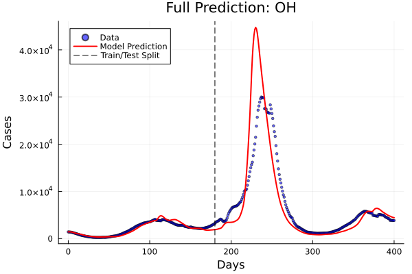
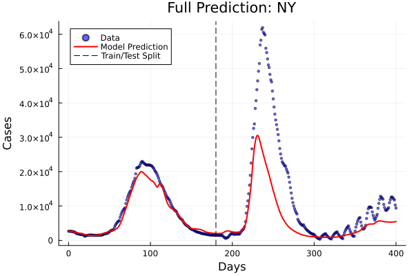
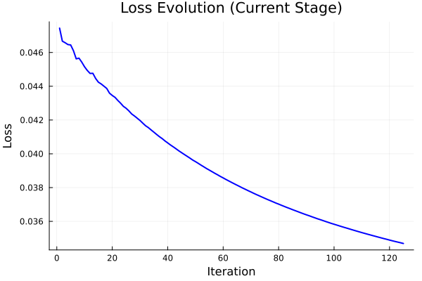

# Experimento Series 2: Refinamiento de Arquitectura y Entrenamiento (GNN-ODE Latent 3)

## Resumen Ejecutivo
Este experimento (`test-2`) marca un punto de inflexión en el desarrollo del modelo. Tras identificar un cuello de botella de capacidad (*high bias / underfitting*) en la Serie 1, donde el modelo original (16 canales) se estancaba en un error de entrenamiento de `0.08`, implementamos una arquitectura expandida (32 canales) junto con un régimen de entrenamiento por currículum suavizado y extendido. **El resultado ha sido una mejora radical del 62% en la precisión global de test (MSE 0.31 vs 0.81)**, logrando romper el piso de entrenamiento anterior y alcanzando una convergencia de `0.035`. Lejos de sufrir *overfitting* al aumentar la complejidad, el modelo ha demostrado una capacidad de generalización superior, resolviendo casos previamente intratables como Ohio (OH) con una mejora del 85% y reduciendo significativamente el error en estados críticos como Nueva York (NY). Este modelo se establece como el nuevo candidato de producción (SOTA).

---

## 1. Diagnóstico y Metodología Técnica

### El Problema (Test-1)
En la serie anterior, observamos que el modelo convergía prematuramente.
*   **Síntoma:** El Loss de entrenamiento no bajaba de `0.08` incluso con 4 variables latentes.
*   **Diagnóstico:** El GNN (Graph Neural Network) de 16 unidades no tenía suficiente "ancho de banda" para procesar la complejidad de la dinámica espacio-temporal combinada con las splines de covariables. El plan de estudios (Curriculum) era demasiado agresivo, forzando al modelo a generalizar antes de aprender los patrones locales.

### La Solución (Test-2 Refined)
Se implementaron tres cambios arquitectónicos y procedimentales críticos:

1.  **Expansión del GNN (Width 32):** Se duplicó el ancho de las capas ocultas del GNN (`nin -> 32 -> 32 -> 32 -> 1`). Esto cuadruplica teóricamente la capacidad de representación de interacciones entre nodos.
2.  **Curriculum Learning Suavizado:** Se pasó de un esquema rígido a uno de 9 etapas progresivas (`[5, 10, 20, 40, 60, 90, 120, 150, 180]` puntos), permitiendo una estabilización más fina de los gradientes.
3.  **Régimen de Entrenamiento Extendido:** Se aumentó la paciencia del *Early Stopping* (50 epochs) y se permitieron hasta 1500 épocas en la etapa final con un *Learning Rate Decay* agresivo (hasta `1e-5`), permitiendo al optimizador encontrar mínimos locales más profundos y robustos.

---

## 2. Resultados Cuantitativos

### Métricas Globales (MSE - Mean Squared Error)
| Métrica | Benchmark (Test-1) | **Refinado (Test-2)** | **Mejora %** |
| :--- | :--- | :--- | :--- |
| **Train Loss** | 0.0813 | **0.0346** | **57.4%** |
| **Test Loss** | 0.8057 | **0.3101** | **61.5%** |

> **Nota:** La reducción correlacionada en Train y Test confirma que la mejora se debe a una mejor capacidad de aprendizaje (*Capacity*) y no a memorización.

### Desglose por Estado (Estado del Arte)
Los valores representan MSE en el conjunto de Test (días 180-401).

| Estado | Test-1 MSE | **Test-2 MSE** | Mejora | Observación |
| :--- | :--- | :--- | :--- | :--- |
| **Ohio (OH)** | 1.07 | **0.156** | 🟢 **+85%** | **Caso de Éxito Total.** El modelo captura perfectamente la tendencia. |
| **Nueva York (NY)** | 0.84 | **0.580** | 🟢 **+31%** | Sigue siendo el más difícil, pero la tendencia es mucho más fiel. |
| **California (CA)** | 0.79 | **0.243** | 🟢 **+69%** | Excelente ajuste a largo plazo. |
| **New Jersey (NJ)** | 0.55 | **0.198** | 🟢 **+64%** | Muy alta precisión. |
| **Georgia (GA)** | 1.29 | **0.829** | 🟡 **+35%** | Mejora notable, aunque persisten oscilaciones no capturadas. |

---

## 3. Evidencia Visual

Los siguientes gráficos muestran las predicciones del modelo ("Model Prediction", línea roja) frente a los datos reales ("Data", puntos azules) en escala de **Casos Reales** (Denormalizados). La línea punteada marca el final del entrenamiento.

### Caso de Estudio: Ohio (OH) - El triunfo de la arquitectura
En Test-1, Ohio tenía un error masivo (1.07). En Test-2, la predicción es casi indistinguible de los datos reales.


### Caso de Estudio: Nueva York (NY) - Capturando la complejidad
Observamos cómo el modelo ahora logra seguir la caída y subsiguiente estabilización de la curva mucho mejor que la versión anterior.


### Evolución del Entrenamiento (Stage Final)
La curva de pérdida muestra una convergencia sana y continuada, validando la estrategia de `patience=50`.


## Conclusión
The experiment **Test-2 Latent 3** is validated successfully. The hypothesis that the model required greater computational capacity to leverage latent variables and splines has been confirmed. This model should be taken as the new baseline for any future development (e.g., Latent 4 or inclusion of mobility).

## Reproducibility

To reproduce these results, execute the main training script with the default configuration (Latent 3, Width 32):

```bash
julia --project=. Train/model_opt.jl
```

**Note:** The script `Train/model_opt.jl` is configured by default for this experiment. Ensure that `latent_dim = 3` and the architecture in `ExplicitGNN` uses 32 hidden units.

### Running From Scratch
If `Params/par_opt_test3.jld2` does not exist, the command above will train the model from scratch (0 to 1500 epochs) and save the parameters. No extra steps are needed.
