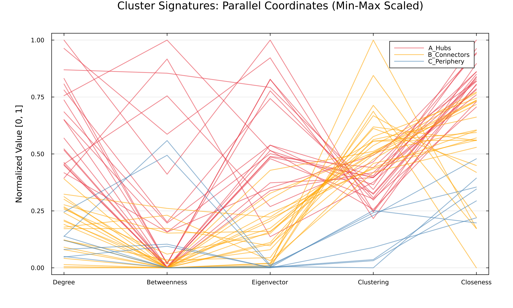
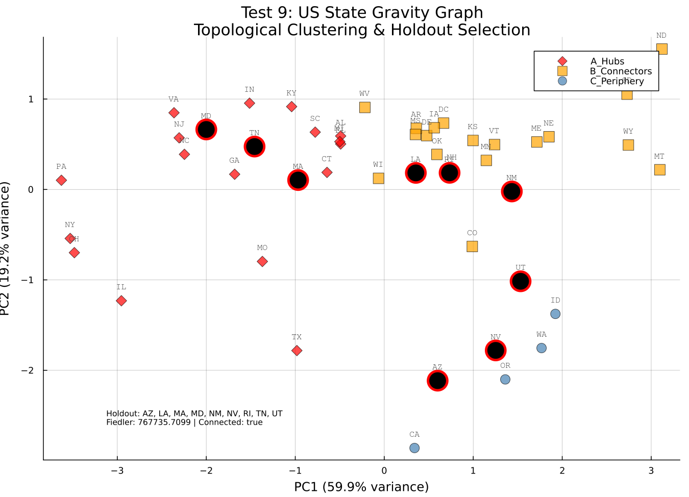
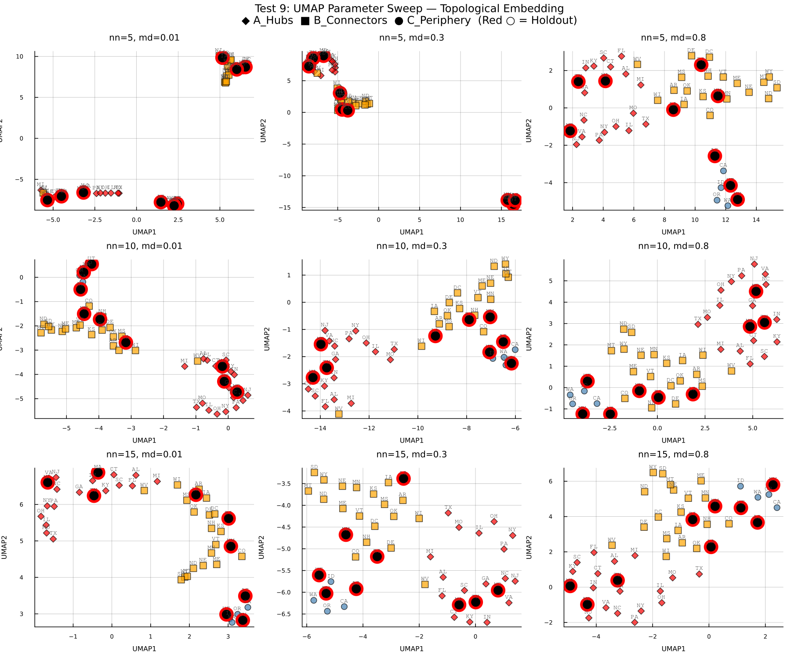
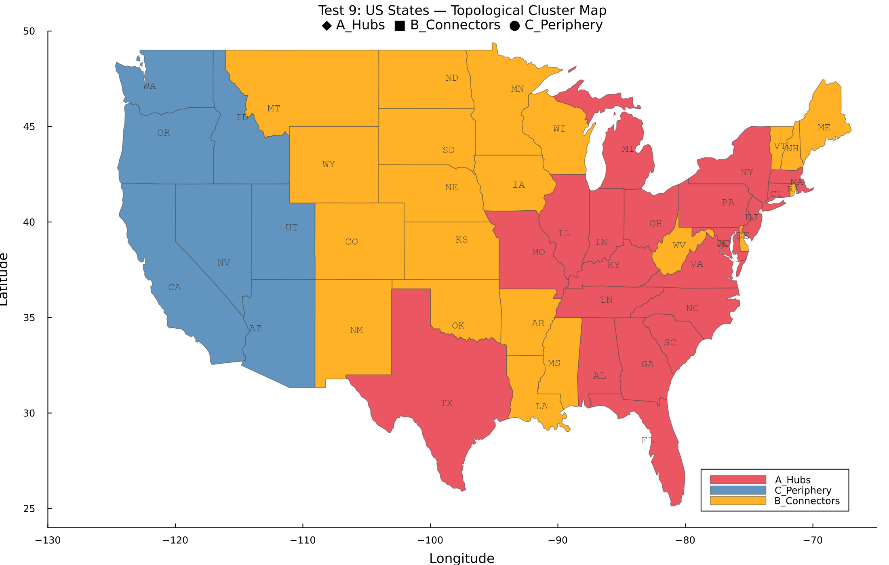

# Experiment: Test 9 — Graph Characterization & Stratified Holdout Selection

## Hypothesis
Can we systematically select a subset of 9 US states for holdout validation that is **topologically representative** of the full gravity graph, while preserving the structural integrity of the 40-state training graph?

## Methodology

### Phase 1: Load Gravity Graph
- Load the pre-computed adjacency matrix from `Data/adj_pop_dist.csv` (49 continental states + DC)
- Build a weighted graph (Graphs.jl), remove self-loops
- The weights represent gravity-model coupling: $A_{ij} = P_i^{0.5} P_j^{0.5} \exp(-d_{ij}/500)$
- **Key finding:** The graph is **fully connected** (1176 edges = 49×48/2) — every pair of states has nonzero weight

### Phase 2: Topological Feature Extraction (5D Vector per State)

To characterize the structural role of each state in the US gravity network, we computed a 5-dimensional topological feature vector. These metrics were chosen to capture different aspects of centrality, connectivity, and redundancy.

1.  **Weighted Degree (Strength)**
    *   **Definition:** The sum of all edge weights connected to a node $i$: $s_i = \sum_{j} w_{ij}$.
    *   **Interpretation:** In our gravity model, this represents the total volume of potential interaction (population flow) a state has with the rest of the country.
    *   **Significance:** States with high weighted degree are **"Super-Spreaders"** or **"Hubs"**. They have the highest potential for importing and exporting infection due to massive aggregate connectivity.

2.  **Weighted Betweenness Centrality**
    *   **Definition:** The fraction of all shortest paths in the network that pass through node $i$. For weighted graphs, "shortest" means "minimum cost," where cost is the inverse of weight ($1/w_{ij}$).
    *   **Interpretation:** Identifies states that act as **bridges** or **gatekeepers** between different regions of the graph.
    *   **Significance:** A state with high betweenness but lower degree might connect distinct clusters (e.g., a state linking the Midwest to the West). Removing such nodes can disproportionately fragment the network.

3.  **Eigenvector Centrality**
    *   **Definition:** A measure where a node's centrality depends on the centrality of its neighbors. $x_i = \frac{1}{\lambda} \sum_{j} w_{ij} x_j$.
    *   **Interpretation:** It is not just about *how many* connections you have, but *who* you are connected to.
    *   **Significance:** A state connected to other highly active states (e.g., New Jersey connected to New York and Pennsylvania) will have high eigenvector centrality. This indicates deep integration into the "core" of the network's infection dynamics.

4.  **Weighted Clustering Coefficient**
    *   **Definition:** A measure of the degree to which nodes in a graph tend to cluster together. For a node $i$, it quantifies the intensity of triangles formed by its neighbors.
    *   **Interpretation:** Indicates **local redundancy**. If state A is connected to B and C, are B and C also strongly connected?
    *   **Significance:** High clustering implies a tightly knit community (e.g., New England states). If a node with high clustering is removed, its neighbors likely still have paths to each other. Low clustering implies a "star-like" or "bridge-like" local structure where the node is essential for local connectivity.

5.  **Weighted Closeness Centrality**
    *   **Definition:** The reciprocal of the sum of the shortest path distances from node $i$ to all other nodes.
    *   **Interpretation:** How "close" a state is to everyone else in the network in terms of effective distance (inverse weight).
    *   **Significance:** Represents **global accessibility**. A state with high closeness can spread infection to the entire network faster than a peripheral state, even if it doesn't have the highest immediate degree.

### Phase 3: Embedding & Clustering
1. **StandardScaler** (Z-score) normalization
2. **PCA** reduction to 2D for visualization (PC1=59.9%, PC2=19.2%, Total=79.1%)
3. **UMAP** with multiple parameter sweeps for nonlinear embedding comparison
4. **KMeans** (k=3) clustering → semantically labeled as:
   - **Cluster A (Hubs):** High degree/eigenvector, low clustering
   - **Cluster B (Connectors):** Moderate degree, high clustering
   - **Cluster C (Periphery):** Low degree, low clustering, bridge role via betweenness

### Phase 4: Stratified Holdout Sampling
- 3 states from Cluster A + 3 from B + 3 from C = 9 holdout states
- **Geographic constraint:** No more than 4 states from the same US Census Region (Northeast, Midwest, South, West)

### Phase 5: Integrity Check ("Lobotomy Check")
- Remove the 9 holdout nodes from the graph → subgraph G'
- Verify G' is **connected** and the **Fiedler value** (algebraic connectivity) is above threshold
- **Auto-repair:** If a bridge node is in the holdout, swap it back and replace with a lower-betweenness node from the same cluster

---

## Results

### Topological Metrics Summary

| Metric | Min | Max | Observation |
|---|---|---|---|
| Weighted Degree | 2.4M (MT) | 51.0M (PA) | Population-driven |
| Betweenness | 0.0 (24 states) | 0.384 (IL) | Only ~25 states are on shortest paths |
| Eigenvector | 0.0001 (WA) | 0.068 (PA) | Strongly correlated with degree |
| Clustering | 0.228 (CA) | 0.918 (ND) | Inversely correlated with degree |
| Closeness | 148K (MT) | 652K (IL) | Geographic centrality |

### Cluster Characterization & Parallel Coordinates

To understand the distinct topological roles of the identified clusters, we visualized their feature profiles using a Parallel Coordinates Plot (Min-Max scaled).



**How to Interpret This Plot:**
Each line represents a single US state, colored by its cluster assignment. The vertical axes correspond to the five topological metrics, each normalized to the range [0, 1] (Min-Max scaling) to allow direct comparison of feature profiles. This visualization reveals the "signature" of each cluster:
*   **Hubs (Red)** dominate the upper ranges of Degree, Betweenness, and Eigenvector centrality.
*   **Connectors (Orange)** are distinguished almost exclusively by high Clustering Coefficients, indicating redundant local connectivity.
*   **Periphery (Blue)** states exhibit structurally "quiet" profiles with low values on most dimensions.

**Analysis of Cluster Profiles:**

1.  **Cluster A (Hubs) — *The Core***
    *   **Profile:** High **Degree**, High **Eigenvector**, High **Closeness**, Low-to-Mid **Clustering**.
    *   **Role:** These are the dominant states in the US gravity network (e.g., NY, CA, TX, FL, IL). They form the "rich club" core.
    *   **Dynamics:** They are the primary drivers of diffusion. Infection reaching a Hub has immediate access to the entire network (high Closeness) and reinforces other Hubs (high Eigenvector).

2.  **Cluster B (Connectors) — *The Fabric***
    *   **Profile:** Moderate **Degree**, High **Clustering**, Moderate **Closeness**.
    *   **Role:** These states (e.g., MN, WI, CO, MO) often form tightly knit regional communities. The high clustering coefficient indicates that their neighbors are also connected to each other, providing **redundancy**.
    *   **Dynamics:** They act as the stable "fabric" of the network. While not super-spreaders, they facilitate robust local circulation.

3.  **Cluster C (Periphery) — *The Outliers***
    *   **Profile:** Low **Degree**, Low **Clustering**, Low **Eigenvector**.
    *   **Role:** geographically or topologically isolated states (e.g., MT, ID, ME).
    *   **Dynamics:** They interact with the network primarily through specific "gateway" connections rather than broad integration. They are the last to be affected by global diffusion trends.

### Cluster Membership Table

| Cluster | N | Members |
|---|---|---|
| **A_Hubs** | 20 | FL, IL, MD, NC, CT, NJ, PA, GA, AL, OH, TX, SC, TN, KY, NY, MI, MO, IN, MA, VA |
| **B_Connectors** | 22 | WV, MN, RI, NH, VT, DE, NM, WI, NE, LA, CO, OK, WY, ND, ME, AR, MS, MT, KS, SD, DC, IA |
| **C_Periphery** | 7 | ID, CA, OR, WA, UT, NV, AZ |

### PCA Visualization



### Final 40/9 Split

**Holdout (9):** `AZ, LA, MA, MD, NM, NV, RI, TN, UT`

| Cluster | Holdout States |
|---|---|
| A_Hubs | MA, MD, TN |
| B_Connectors | LA, NM, RI |
| C_Periphery | AZ, NV, UT |

**Region distribution:** West (4), South (3), Northeast (2) ✓

### Integrity Check
- Training graph (40 states): **Connected** ✓
- Fiedler value: **767,735** (no repair needed)

### UMAP Analysis

UMAP embeddings with multiple parameter sets to explore nonlinear structure:



### Geographic Cluster Map

US states colored by topological cluster. Holdout states are marked with bold borders.



---

## Outputs

| File | Description |
|---|---|
| `metrics_table.csv` | Full 49-state topological metrics |
| `pca_clusters.png` | PCA scatter plot with clusters and holdout marked |
| `umap_sweep.png` | UMAP embeddings with multiple n_neighbors / min_dist |
| `cluster_map_us.png` | Geographic US map colored by topological cluster |
| `holdout_selection.json` | Final training (40) and holdout (9) sets |

## Reproducibility

```bash
cd /path/to/Graph_neural_ode_covid
# Main analysis (PCA + clustering + holdout selection)
julia --project=. Resultados/test-9/graph_characterization.jl

# UMAP visualization sweep
julia --project=. Resultados/test-9/umap_analysis.jl

# Geographic cluster map
julia --project=. Resultados/test-9/plot_cluster_map.jl
```

**Requirements (Project.toml):** `Graphs`, `SimpleWeightedGraphs`, `CSV`, `DataFrames`, `Plots`, `JSON`, `LinearAlgebra`, `Statistics`, `UMAP`.
