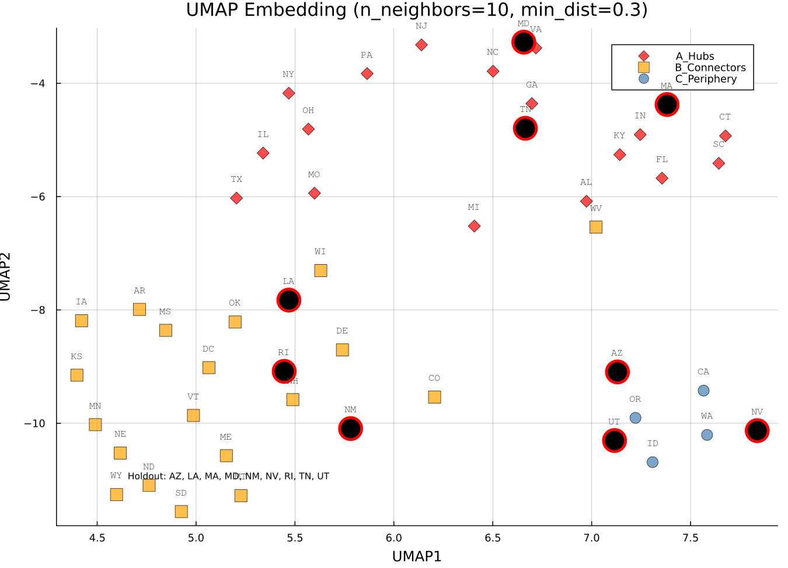

# Walkthrough: Test 9 — Graph Characterization & Holdout Selection

## What was built

Two Julia scripts for analyzing the 49-state US gravity graph:

1. [graph_characterization.jl](file:///Users/matias/Documents/codigo/Graph_neural_ode_covid/Resultados/test-9/graph_characterization.jl) — Metrics + PCA + KMeans + stratified holdout selection
2. [umap_analysis.jl](file:///Users/matias/Documents/codigo/Graph_neural_ode_covid/Resultados/test-9/umap_analysis.jl) — UMAP parameter sweep for nonlinear embedding comparison
3. [plot_cluster_map.jl](file:///Users/matias/Documents/codigo/Graph_neural_ode_covid/Resultados/test-9/plot_cluster_map.jl) — Geographic US map colored by topological cluster

## Key Discovery: Fully Connected Graph

The gravity graph has **1176 edges** (= 49×48/2) — every pair has nonzero weight. This made k-core useless (all = 48), replaced with **weighted closeness centrality**.

## Results

### PCA Clustering (79.1% variance explained)

| Cluster | N | Profile |
|---|---|---|
| **A_Hubs** | 20 | High degree/eigenvector — PA, NY, OH, IL, etc. |
| **B_Connectors** | 22 | Moderate degree, high clustering — WI, IA, LA, etc. |
| **C_Periphery** | 7 | Western states, bridge role — CA, OR, WA, AZ, etc. |

**Holdout (9):** AZ, LA, MA, MD, NM, NV, RI, TN, UT — **Connected** ✓, Fiedler = 767K

### PCA Scatter

### UMAP Parameter Sweep (3×3 grid)
n_neighbors ∈ {5, 10, 15} × min_dist ∈ {0.01, 0.3, 0.8}

### Best UMAP (nn=10, md=0.3)

### Geographic Cluster Map

## Output Files

| File | Size |
|---|---|
| [metrics_table.csv](file:///Users/matias/Documents/codigo/Graph_neural_ode_covid/Resultados/test-9/metrics_table.csv) | 7.6 KB |
| [holdout_selection.json](file:///Users/matias/Documents/codigo/Graph_neural_ode_covid/Resultados/test-9/holdout_selection.json) | 865 B |
| [pca_clusters.png](file:///Users/matias/Documents/codigo/Graph_neural_ode_covid/Resultados/test-9/pca_clusters.png) | 100 KB |
| [umap_sweep.png](file:///Users/matias/Documents/codigo/Graph_neural_ode_covid/Resultados/test-9/umap_sweep.png) | — |
| [umap_best.png](file:///Users/matias/Documents/codigo/Graph_neural_ode_covid/Resultados/test-9/umap_best.png) | — |
| [cluster_map_us.png](file:///Users/matias/Documents/codigo/Graph_neural_ode_covid/Resultados/test-9/cluster_map_us.png) | — |
